IONIC 功能全演示
=====================

- 使用Ionic提供的UI 组件。Ionic本身是致力于建立统一的移动混合app构建平台，核心基础是Angular+Cordova。
- 通过Angular指令封装，以及预定义的CSS，提供了开箱即用的HTML5 Mobile组件。
- 构建与开发支持，能够直接运行www目录下的index.html进行开发调试。同时也支持发布人员利用gulp构建输出到dist目录
- 利用gulp，同样演示了单元测试以及场景测试。
- [在线演示，内有地址二维码，可手机浏览](http://1.thm1118.sinaapp.com/static/ionic/www/index.html)

## 预览

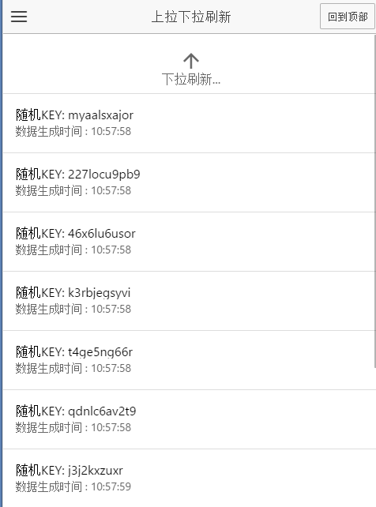
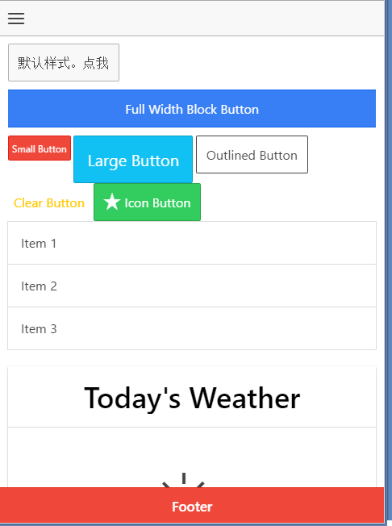
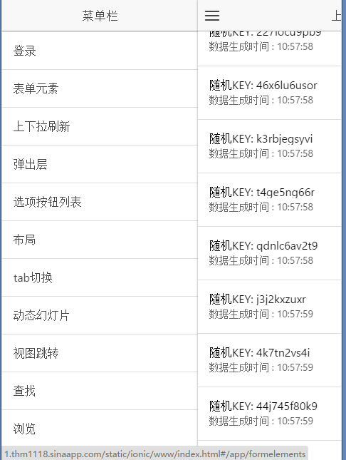
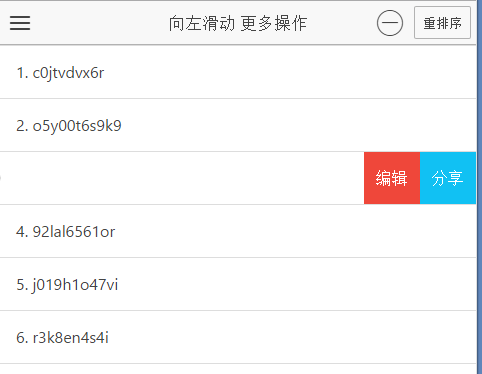
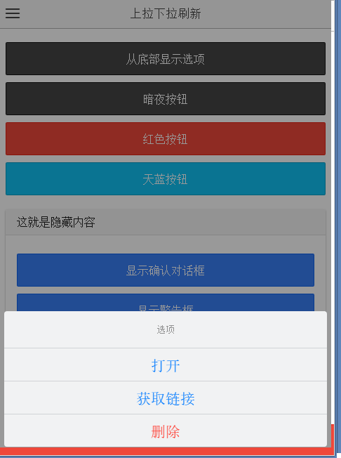

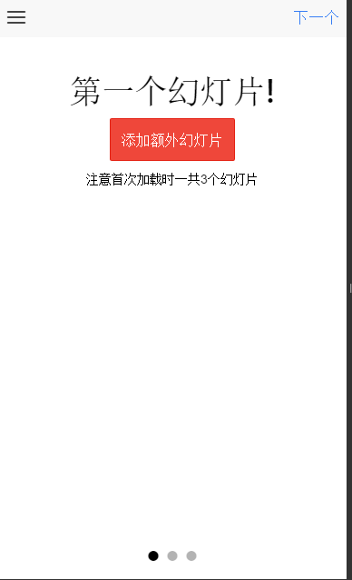
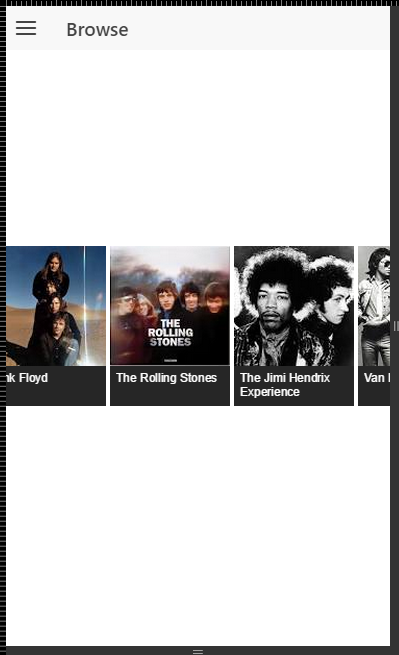

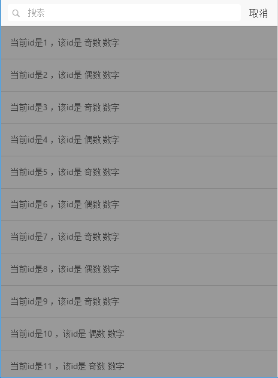
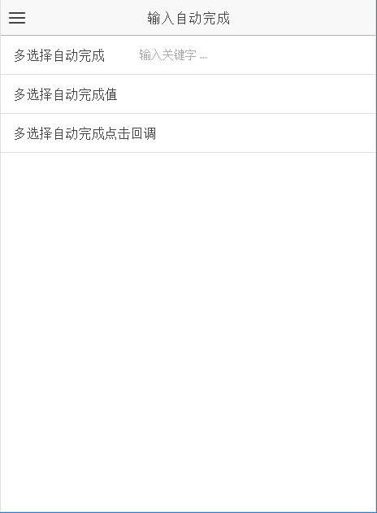
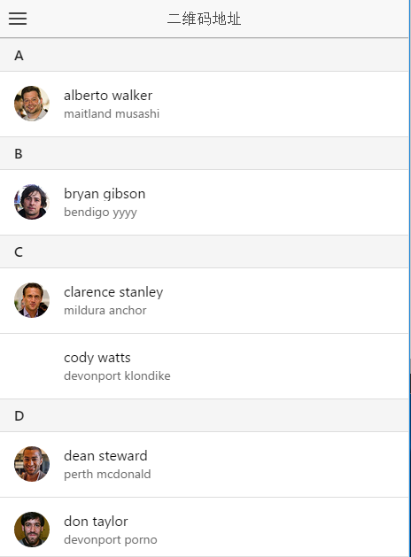

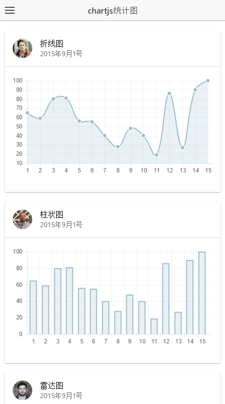
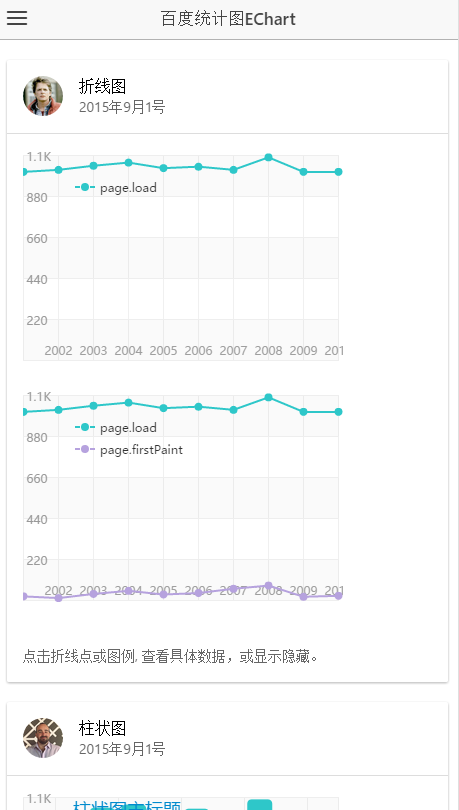
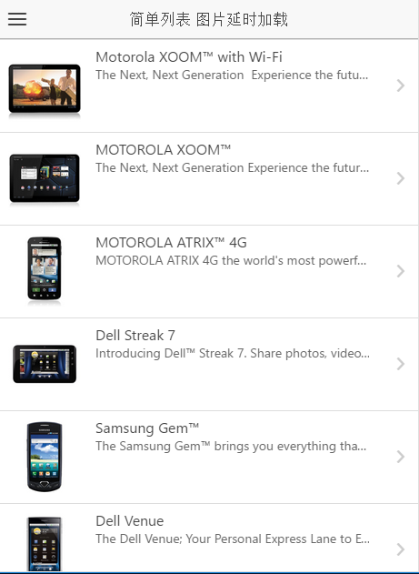

## 基础环境

纯webapp运行或演示，只需要一个 web server部署即可。

## 目录结构说明

- www 目录：源码目录
- dist目录：构建输出目录

## 利于开发，测试和打包部署的nodejs环境

简单开发可以不依赖nodejs环境。但是有了基于nodejs的javascript完整开发周期环境，会极大提升开发效率，保障质量。

- nodejs 最新版。
- 有些node包的安装需要c++编译，x86版本只需要 x86的C++编译器，windows上的x64 c++编译器需要特别设置。
- npm 会很慢，要么使用代理，要么使用国内镜像，比如 [淘宝镜像](http://npm.taobao.org/) , 使用淘宝镜像后，npm命令需要替换成cnpm命令。
- `npm install -g gulp`
- `npm install -g ionic`
-  如需编译sass的话，安装 [ruby](https://www.ruby-lang.org/zh_cn/),再执行 `gem install sass`（如遇到ssl错误，修改为http源：gem source -a http://rubygems.org/）
-  `npm  install -g node-gyp`
-  有的node包依赖python编译，安装 [python2.7](https://www.python.org/)
-  c++编译环境[MSVStudio 免费版](https://www.visualstudio.com/downloads/download-visual-studio-vs#d-express-windows-desktop).。注意根据studio不同版本指定 --msvs_version=2013 选项
-  安装项目开发依赖包，在项目根目录下运行 `npm install`

### “所见即所得”式开发

- 在项目根目录下运行 `ionic serve`，即可在www目录下开展“所见即所得”的方式开发
- 另外一种方式，在webstorm里对index.html 按debug运行，同样是“所见即所得”的方式开发

### CROS支持

- 生产环境的 CROS支持要么使用jsonp技术，要么在服务端设置代理。

- 而开发环境下要么 基于不安全做法，服务端api 设置头`Access-Control-Allow-Origin:*" `，要么按如下便捷设置：
基于`ionic serve`, 可以在开发时使用本地代理。ionic.project 内设置：

`{
   "name": "app",
   "app_id": "",
   "proxies": [{
     "path": "/api/forecast",
     "proxyUrl": "https://api.forecast.io/forecast/APIKEY/"
   }]
}`

注意 proxies 意味着可以设置多个代理。path是需要代理的url，proxyUrl是实际指向的url

### Sass支持

- 默认情况是使用预先编译好的css文件,在www/lib/ionic/css目录下。
- 可以开启[Sass](http://sass-lang.com/)开发样式：`ionic setup sass`
- sass代码写在 ./scss/ionic.app.scss 内
- 移除index.html内的`<link href="lib/ionic/css/ionic.css" rel="stylesheet"> ,<link href="css/style.css" rel="stylesheet">`,增加`<link href="css/ionic.app.css" rel="stylesheet">`
- 注意所有的css引用都必须放在 `<!-- inject:css -->` 内
- 在 ionic.project 内增加 "gulpStartupTasks": ["sass", "watch"]
- 开启Sass开发模式后，可以通过运行 `ionic serve` 开所见即所得的方式 看到sass代码变化带来的结果. 或者手工运行gulp任务
- [Sass自定义ionic主题指南](http://learn.ionicframework.com/formulas/working-with-sass/)

## Ionic 相关 

开发必看

- [Ionic地址](http://ionicframework.com/)
- [入门](http://ionicframework.com/getting-started) 
- Ionci工具 [Ionic CLI](https://github.com/driftyco/ionic-cli)

## gulp构建流程

- 如果是简单开发，不需要构建。可以通过webstorm，运行index.html即能使用。
- 如果需要产品发布，则需要按照上文要求，准备好node开发环境，然后在根目录成功执行`npm install`后，可以执行预定义的构建任务。
- 预定义构建任务主要分为三个：1、日常sass编译；2、开发构建； 3、发布构建； 
- 1、日常sass编译： 当前目录执行`gulp` 即可，将自动编译scss目录下的ionic.app.scss文件，并持续监测该文件是否改动，如发生改动，则重新编译输出。详见上文。
- 2、开发构建：`gulp dev:pipeline` 对www目录进行构建，输出到dist目录。构建内容主要是拷贝js，css，图片，字体等文件，并在index.html中自动替换新引用。并自动执行单元测试。开发构建的目的主要是为产品构建做准备。
- 3、发布构建：`gulp prod:pipeline` 对www目录构建，输出到dist目录，除了开发构建内容外，还对图片，js，css等进行压缩合并，并把模板文件编译成js。对目标js执行单元测试。同时对js，css的引用增加时间戳，解决更新后客户端缓存刷新。

- 注意1：www目录下的assets.json 文件里，按顺序列出了需要构建的 css，js文件。上述两种构建都只读取该文件内的文件列表进行构建，不在该文件内的js或css文件会被忽略。
- 注意2：  在www目录下的index.html 中，有如下注释标记，构建时用来插入、全部替换其中的内容，删除该标记 将导致无法引用构建后的js或css文件。

         <!-- inject:css -->
         <!-- endinject -->
         <!-- inject:js -->
         <!-- endinject -->
        
       为了在开发时，同时也支持直接基于www目录开发和运行，可以在该标注内引用相关js和css，但是如上文描述，实际构建插入的js和css来自assets.json文件内的引用描述

- 注意3：app.js 内定义了主模块名：starter （`angular.module('starter'`），构建时编译templates目录下的模板文件时，硬编码使用 starter 模块名，如果需要更改app.js内的主模块名，则需要对应到构建描述文件gulp.js内更改模板编译的对应模块名(mainModuleName)，否则将导致模板文件无法加载的错误.
       
- 与`ionic serve`命令整合的自动构建，该命令默认是监测www目录，并在www目录上创建一个web服务：
    
    在ionic.project文件内添加或编辑下面内容：
    
        "documentRoot": "www",
        "createDocumentRoot": true,
        "watchPatterns": ["dist/**/*"],
        "gulpStartupTasks": ["dev:pipeline" ]
                            
    这样在执行`ionic serve`命令时，先执行gulp开发构建，输出到dist目录，ionic 监测dist目录，并在dist目录上创建web服务。
    
- 构建的版本设定：根目录下config文件夹内分别有开发构建和发布构建两个json文件，修改里面对应值，构建时会自动更新constant.js内的对应键值。
    
## 添加或移除js

- 添加第三方js：`bower install XXXX --save`，会自动安装新的js库到www目录中的lib目录下。注意需要在assets.json内为构建配置包括该js，
- 添加自己开发的js，放在www目录中的js目录下，同样需要在assets.json内配置。
- 在www内的index.html内引用新js时，注意放在`<!-- inject:js -->`内 

## 单元测试和场景测试

- 参照test目录编写

## 远程调试

- 微信的android版本的内置浏览器是腾讯x5，大致相当于webkit40，具体版本号很神秘，渲染能力和性能有些问题，参考官方说明[Inspector调试WebView](http://x5.tencent.com/guide?id=2001)

## 其他注意事项：

- 出于功能演示目的，引入了一些第三方库，以及各种图片，实际不需要时应该移除，否则导致带宽浪费，加载时间长
- 出于演示登录的权限控制，在app.js 内使用了 通常用于单元测试的$httpBackend，会拦截所有http请求，开发时需要移除.

## todo：

- 微信浏览器的android版本，默认使用其内置的腾讯浏览器，其兼容性有一定问题，比如水平滚动图片
- 测试中增加性能计数 [protractor-perf](https://github.com/axemclion/protractor-perf)

